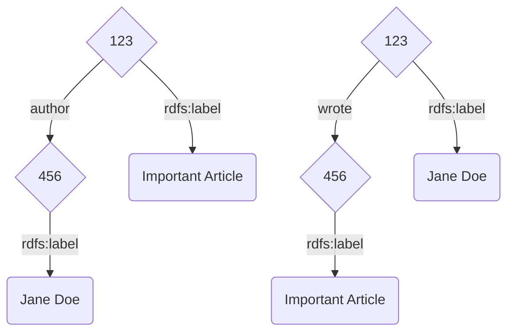
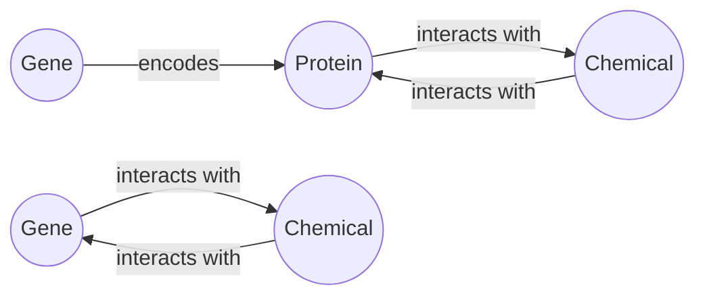
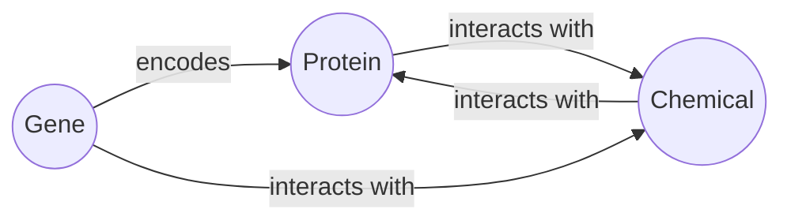
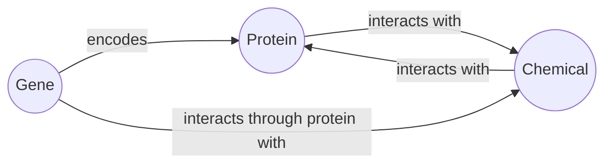
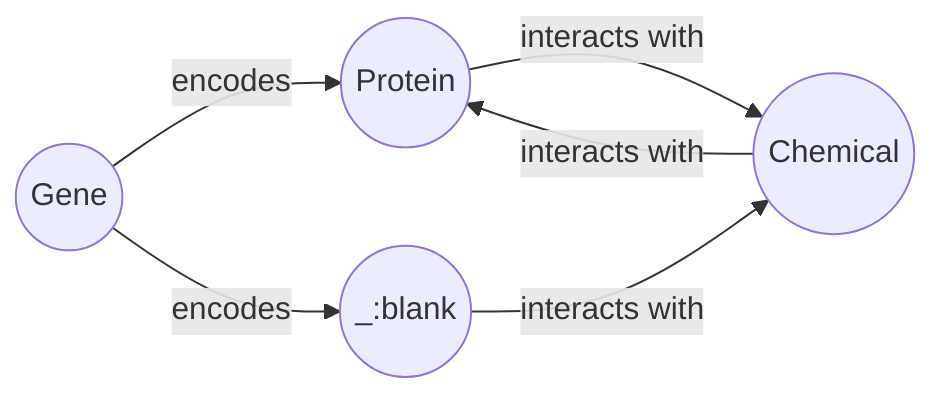

<script src="mermaid.full.min.js"></script>
<a href="https://github.com/wisecubeai/graphster"></a>


`Graphster` is an open-source knowledge graph library. 
It is a spark-based library purpose-built for scalable, end-to-end knowledge graph construction and querying from unstructured and structured source data. 
The graphster library takes a collection of documents, extracts mentions and relations to populate a raw knowledge graph, links mentions to entities in Wikidata, and then enriches the knowledge graph with facts from Wikidata. Once the knowledge graph is built, graphster can also help natively query the knowledge graph using [`SPARQL`](https://en.wikipedia.org/wiki/SPARQL/).

Give [`graphster`](https://github.com/wisecubeai/graphster) a try!


This README provies instructions on how to use the library in your own project.


# Table of contents <a name="toc"></a>
1. [Setup](#setup)
2. [How to build a knowledge graph](#howto)
   1. [Configuration](#configuration)
   2. [Data Sources](#datasource)
   3. [Extraction](#extraction)
   4. [Graph](#graph)
      1. [RDF Data](#rdf)
      2. [Other Graph Formats ](#formats)
   5. [Structured Data](#structured)
   6. [Text Data](#text)
   7. [Fusion](#fusion)
   8. [Mapping](#mapping)
3. [Library](#library)
   1. [Modules](#modules)
   2. [Current](#current)
   3. [Roadmap](#roadmap)
4. [Examples](#examples)
   1. [Configuration Examples](#conf-example)
   2. [Structured Examples](#structured-example)
   3. [Text Examples](#text-example)
   4. [Query Examples](#query-example)
   5. [AI Examples](#ai-example)

## Setup <a name="setup"></a>

Clone [graphster](https://github.com/wisecubeai/graphster):

```
git clone https://github.com/wisecubeai/graphster.git

```

# How to build a knowledge graph <a name="howto"></a>


## Configuration <a name="configuration"></a>

The foundation for any graphster pipeline is the configuration. 
This allows you to not only set important properties, but also lets you simplify the references to data elements.
In building a graph, there will be many explicit references to specific data elemetns (e.g. URIs). 
Having these littered around your code hurts readability, and re-usability.

[back to top](#toc)

## Data Sources <a name="datasource"></a>

In order to build a knowledge graph you must be able to combine data from other graphs, structured data, and text data. 

1. Graph data: e.g. OWL files, RDF files
2. Structured data: e.g. CSV files, RDBMS database dumps
3. Text data: e.g. Document corpus, text fields in other kinds of data (>= 50 words on average)

The difficulty is that these data sets require different kinds of processing. The idea here is to transform all the 
data into structured data that will then be transformed into a graph-friendly format. This breaks this complex 
processing into three phases.

1. Extraction: where we extract the facts and properties that we are interested from the raw source data
2. Fusion: where we transform the extracted information into a graph-friendly format with a common schema
3. Querying: where we search the data

Now that we have broken up this complex process into more manageable parts, let's look at how this library helps 
enable graph construction.

[back to top](#toc)

## Extraction <a name="extraction"></a>

The extraction phase will generally by the most source-specific part of ingestion. In this part logic necessary for 
transforming the data into a format fusing into the ultimate graph's schema.

### Graph <a name="graph"></a>

#### RDF data <a name="rdf"></a>

If the graph data comes in an RDF format then only minimal transformation will be required at this stage. This data 
should be parsed into tables with the Orpheus schema. The fusion step is where the IRIs, literals, etc. will be mapped 
to the ultimate schema.

#### Other Graph Formats <a name="formats"></a>

This data should be treated as structured data.

### Structured <a name="structured"></a>

There are two main concerns structured data - quality and complexity. Of course, general data quality is always 
important in data engineering, here we are talking about a specific kind of data quality. The kind of data quality we 
are concerned with is completeness and consistency. What fields are null? In what formats are different data types 
stored (e.g. dates, floating point, booleans). Complexity is the other ingredient we must manage. Transforming a 30 
column CSV into a set of triples is very different from a database with dozens of tables in 3rd normal form.

### Text <a name="text"></a>

In order to add text into a graph, we must extract the information we are interested into a structured format. This is 
where NLP comes in. This library is not an NLP library, which is why there is an abstraction layer. The idea is that 
the information is extracted into a structured form, so that the downstream process does not need to know what engine 
was used for NLP.

The minimal requirement for an NLP library to serve as an engine is named entity recognition. However, supporting 
syntactic parsing, entity linking, and relationship extraction can also be utilized.

The `wisecube-text` module is a module that acts as an interface to an NLP engine. There is an implementation with JSl 
Spark NLP.

[back to top](#toc)

## Fusion <a name="fusion"></a>

The fusion step is where we take the structured data that has been cleaned, transformed, or extracted and map into the 
schema of the graph we are building. The first step of fusing new data into a graph is matching what is already there. 
Matching entities in the new data to entities already in the graph. The next step is mapping the kinds of relationships 
and properties to predicates.

### Mapping to schema <a name="mapping"></a>

There are two reasons to have custom transformations at this stage. The first is dealing differences in the conceptual 
design between the new data and the graph. The second is differences in the conventions recording properties.

For example, if your graph has an "author" relationship between documents and authors, but the new data has "wrote" 
relationship between authors and documents. 



This is a simple example. The direction of the relationship needs only be reversed. Let's consider an example with a 
deeper difference. Suppose the graph with which we are fusing keeps certain closely related terms as a single entity - 
[Metonymy](https://en.wikipedia.org/wiki/Metonymy). For example, let's say the graph contains proteins, genes, and 
chemicals. The data that is being added only has genes and chemicals. In this data, relationships between a gene and a 
chemical may actually represent a relationship between a protein encoded by the gene and the chemical.



How this is mapped to the target schema depends on what other data is available as well as how flexible the schema is. 
If there is additional information about the gene-chemical edges that we can use to deduce the protein (e.g. pathway 
information), that can be used. Another option, if no such information is available, is to overload the 
`interacts with` edge in the target graph to allow gene-chemical relations.



If such overloading is not possible in the target schema, then these edges can be represented with a special edge.



Another option is to use blank nodes, and to try and resolve them with other data.



[back to top](#toc)

# Library <a name="library"></a>


## Modules <a name="modules"></a>
## Current <a name="current"></a>
## Roadmap <a name="roadmap"></a>

# Examples <a name="examples"></a>

## Configuration Examples <a name="conf-example"></a>
## Structured Examples <a name="structured-example"></a>
## Text Examples <a name="text-example"></a>
## Query Examples <a name="query-example"></a>
## AI Examples <a name="ai-example"></a>